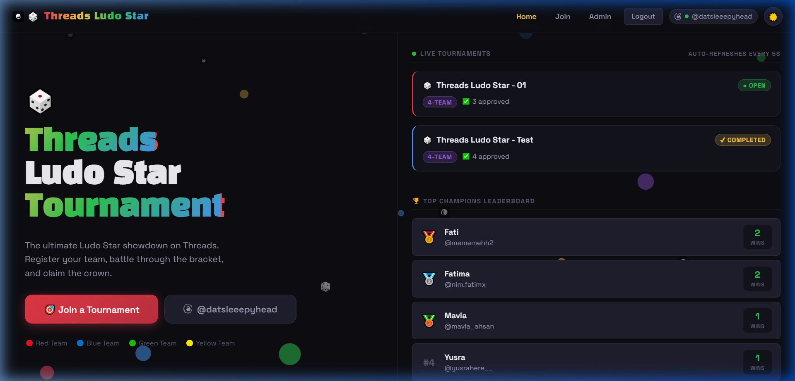

# 🎲 Threads Ludo Star Tournament

A premium tournament management platform built for Ludo Star enthusiasts. Organize tournaments, manage brackets, track matches, and showcase winners with a sleek, threads-inspired UI.

## 🔗 Live Demo
Check out the live app here: [https://ludo-tournament-ivory.vercel.app/](https://ludo-tournament-ivory.vercel.app/)

## 📸 Preview


## 🚀 Features

-   **Dynamic Brackets**: Support for 4-team and 8-team single-elimination formats.
-   **Manual & Random Seeding**: Admins can precisely pair teams or use a random draw.
-   **Live Updates**: Real-time match status and winner progression.
-   **Leaderboard**: Track the top 10 players by tournament wins.
-   **Premium Aesthetics**: Modern dark-mode UI with floating animations and threads-branded elements.
-   **Admin Dashboard**: Comprehensive control over registrations, approvals, and match results.

## 🛠️ Tech Stack

-   **Frontend**: React, Vite, Vanilla CSS
-   **Backend**: Node.js, Express.js
-   **Database**: Supabase (PostgreSQL)
-   **Authentication**: JWT & Bcrypt
-   **Hosting**: Vercel

## 📦 Setup & Installation

### 1. Database Setup
1. Create a project on [Supabase](https://supabase.com).
2. Run the SQL schema provided in `supabase_schema.sql` in the Supabase SQL Editor.

### 2. Environment Variables
Create a `.env` file in the `/server` directory:

```env
SUPABASE_URL=your_supabase_url
SUPABASE_ANON_KEY=your_anon_key
SUPABASE_SERVICE_ROLE_KEY=your_service_role_key
JWT_SECRET=your_jwt_secret
```

### 3. Local Development
Run the one-time setup:
```bash
./SETUP.bat
```
Start the application:
```bash
./START.bat
```

## 🛡️ Security Note
This project uses environment variables to store sensitive keys. Never commit your `.env` files to GitHub. A comprehensive `.gitignore` is included to prevent accidental exposure.

## 🤝 Project by
Organized and maintained by the Threads Ludo Star community.
